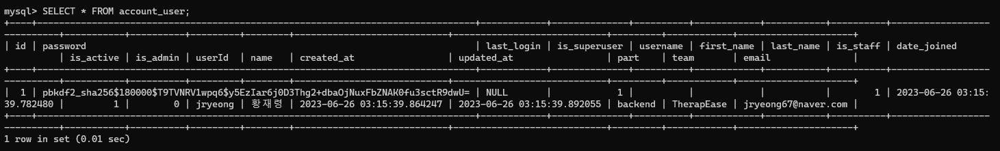
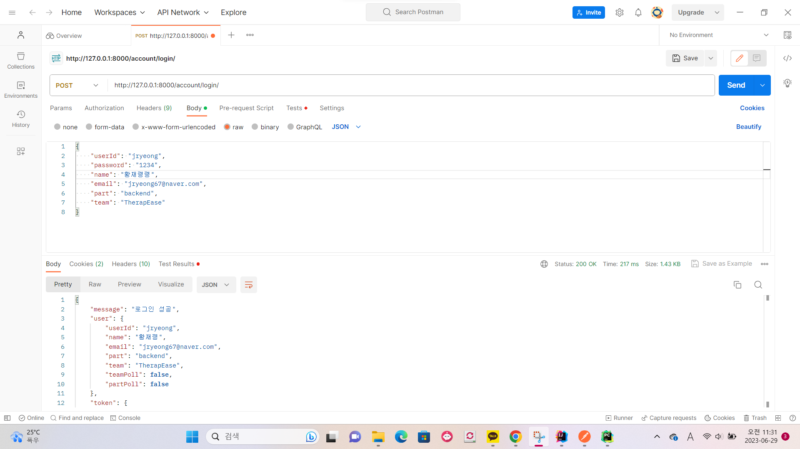

# django-vote-17th
파트장/데모데이 투표

### api 명세서
https://www.notion.so/Toy-project-API-1939a4b8dde146018f30ee35ba8e9777?pvs=4

### 구성🍒

- `develop` : 현재 개발이 완료된 상태와 일치하는 branch 입니다. 🍒
- `master` / `main` : 현재 production 의 상태와 일치하는 branch 입니다. 🍒
- `feature` : `develop` 을 현재 개발 완료 상태와 일치시키면서 **다른 동료와 conflict가 생기지 않도록** 작업하기 위해 사용하는 branch 입니다. 🍒
- `release` : release 준비를 시작한 뒤, `develop` 에 merge한 **다음 release feature 로부터 안전한 release를 하기 위해** 사용하는 branch입니다.
- `hotfix` : `develop` **과 독립적으로** production에서 발생한 문제를 `master` 에서 처리하기 위해 사용하는 branch 입니다.


# 🛠️ **마지막 과제**

### **17기 파트장 및 데모데이 투표 서비스**

## 필수 기능

### 1. 회원가입

- 회원가입에 필요한 필드는 **아이디**, **비밀번호**, **이메일, 파트, 이름, 팀**입니다.
- **아이디, 이메일**은 중복될 수 없습니다. 
회원가입 과정 중에 중복 체크는 자유롭게 하셔도 됩니다.
    
    (중복체크 API를 따로 제작 혹은 회원가입 완료 시에 한 번에 체크)
    
- **파트**는 (프론트엔드, 백엔드) 중 하나를 선택할 수 있게 해주시면 됩니다.
- **팀**은 (RePick, 바리바리, Hooking, Dansupport, TherapEse) 중 하나를 선택할 수 있게 해주시면 됩니다.
api 명세서  
  
  

회원가입 request & response  

-> 파트 선택시 back과 front만 가능하다.

- 
회원가입한 user 정보 -> db에 반영된 결과

### 2. 로그인

- 사용자 로그인 여부는 JWT를 통해 인증합니다.
- 아이디 혹은 비밀번호가 틀렸을 시에는 에러를 반환합니다.
- [참고자료](https://django-rest-framework-simplejwt.readthedocs.io/en/latest/getting_started.html)

로그인 request & response  
  
  
- 로그인 시 access token 발급
- 회원 가입시 입력했던 정보를 찾을 수 없을 땐 로그인 실패와 함께 에러 메세지를 반환

local postman login test를 했을 시 화면입니다. 


### 3. 투표

- 후보는 득표 순으로 **내림차순 정렬**되어 보여집니다
```angular2html
team_polls = teamPoll.objects.order_by('-voteCnt')
```
: 'teamPoll' 모델에서 팀 투표를 가져와 '-voteCnt'를 기준으로 내림차순으로 정렬
- 투표 방법에 대해서는 제약이 없습니다. 한 아이디당 한 번만 투표하게 만드셔도 좋고, 투표 버튼 누르는 대로 득표수가 올라가도 상관없습니다.
-> 투표 버튼을 누르는 대로 득표수가 올라가도록


api 명세서  
  
  
  

## 데모데이 후보 조회 & 투표하기  
- 로그인한 사용자만 투표 가능
- 본인이 속한 팀을 제외하고 투표할 수 있다.
  
  
  


## 파트장 후보 조회 & 투표하기  
- 역시 로그인한 사용자만 투표 가능
- 본인의 파트에 해당되는 파트장 투표만 가능하다.
  
  
 
- 모델의 userId 필드와 사용자의 part를 비교하여 같은 경우에만 투표가 가능하도록 구현

----------------
## 회고
여태까지 장고로 프로젝트 만드는 과정들을 복습할 수 있어서 유익했습니다.
트러블 슈팅의 경우 중간에 갑자기 도커프로그램이 켜지지 않아 시간을 많이 잡아먹었던 것이 가장 큰 이슈였는데, 현우오빠의 도움을 받아 aws 서버에서 켜는 방식으로 해결을 했습니다. 
그리고 노션, 구글 미트, 카카오톡, slack 등으로 서로 피드백을 주고 받으면서 협업을 경험할 수 있었기 때문에 의미있었던 시간이었습니다.
앞으로 7월에 진행될 테라피즈 프로젝트도 이와 같은 방식으로 진행해서 잘 마무리해야겠다고 생각했습니다.


